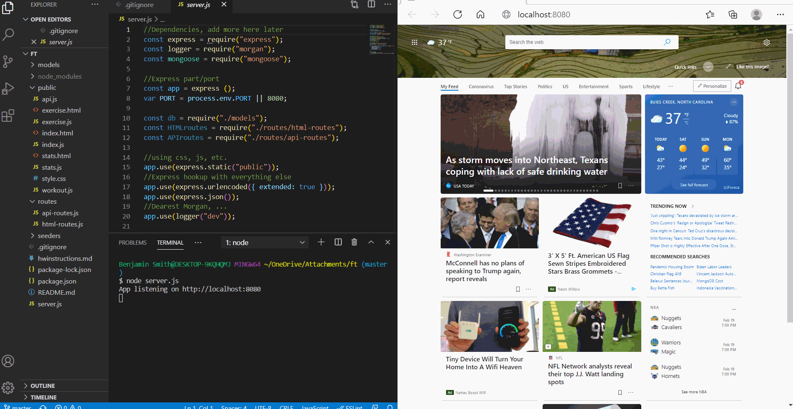

# Title: ft
## Author (or contributors): Benjamin Smith

## Table of Contents
* [License](#license)
* [Description](#description)
* [Contributing](#contributing)
* [Tests](#tests)
* [Installation](#installation)
* [Usage](#usage)
* [Questions](#questions)

### License:
#### 
Apache

### Description: 
#### 
This is a fitness tracker. It gives you basically everything except for the duration.

### Contributing:
#### 
Benjamin Smith

### Tests:
#### 
 

### Installation: 
#### 
Enter the necessary information for your workouts. It is pretty straightforward. Click "Add Workout" when you have entered everything and a message saying "successfully added" will come at the top right of your screen. Then, click "Complete," wait a few minutes, and it should produce the workout information. Click on the top left Dashboard to see your workout stats after entering a couple workouts.

### Usage: 
#### 
BEWARE, this application is more likely to work locally than through the heroku deployed app. Please look at the gif I included in this README to see how it works.

### Questions:
#### 
Email is best!

* [Github profile](https://github.com/Bsmi3275)

* Email: bbsmith1107@email.campbell.edu
#### 
 

